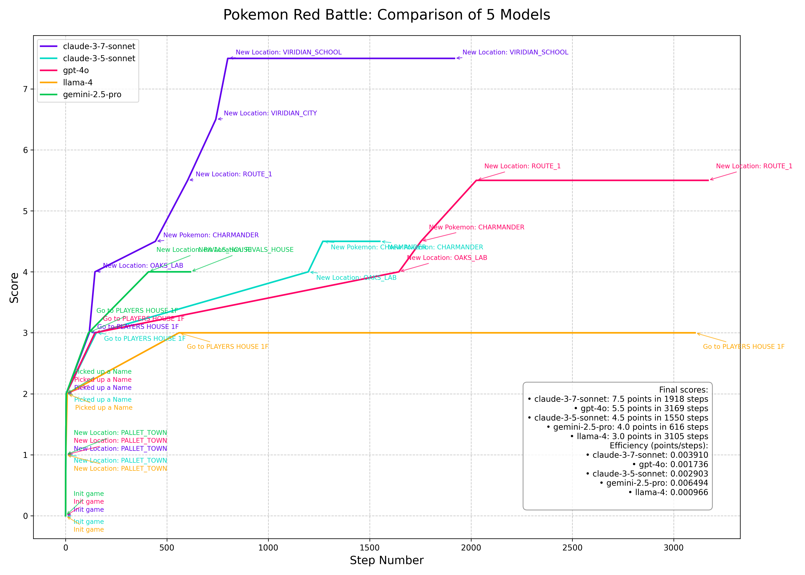

# PokemonGym Results

This directory contains evaluation results comparing different LLM agents playing Pokemon Red.

## Overview

The comparison shows how various LLM models (Claude-3.5-Sonnet, Claude-3.7-Sonnet, GPT-4o, Gemini-2.5-Pro, and Llama-4) perform in playing Pokemon Red. The evaluation measures progression through the game, battle strategy, and overall effectiveness.

## Results

## Data Access

The complete trace data and gameplay logs can be downloaded from:
[https://drive.google.com/file/d/1uTaexC23GOnMLMe8txHsKlzB2SMybhF1/view?usp=drive_link](https://drive.google.com/file/d/1uTaexC23GOnMLMe8txHsKlzB2SMybhF1/view?usp=drive_link)

## Methodology

Models were evaluated based on their ability to progress through the game, make strategic decisions in battles, and complete objectives. The scoring system rewards progress milestones and effective battle tactics.

The comparison uses standardized metrics to ensure fair comparison across all models. 